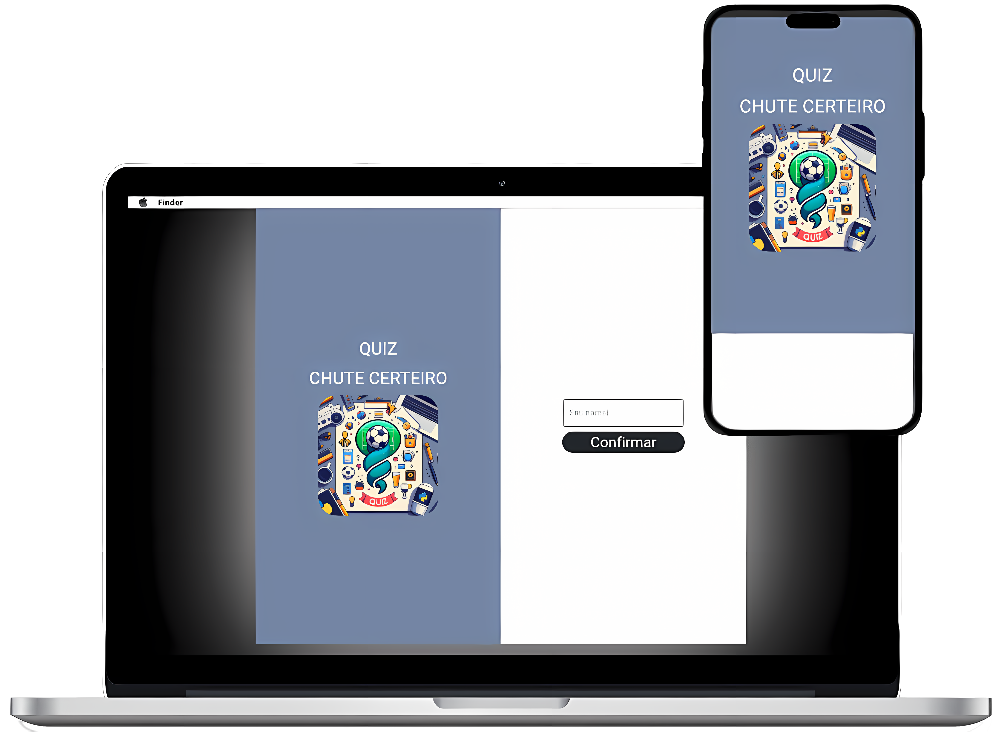

# Projeto Chute Certeiro ⚽

  

Este projeto foi feito no curso do SENAI - Ipiranga-SP referente a [Python](https://www.sp.senai.br/curso/programacao-em-python/102657)

>A [API de Futebol](https://www.api-football.com/documentation-v3#section/Authentication/API-SPORTS-Account) foi escolhida por sua riqueza de dados e a popularidade do futebol. Ela fornece informações detalhadas sobre ligas, equipes e jogadores de futebol de todo o mundo, tornando-a uma excelente escolha para um projeto de quiz de futebol.

> O projeto propõe um quiz interativo de futebol que testa o conhecimento do usuário sobre diferentes ligas de futebol. O usuário pode escolher a liga e o ano do campeonato, e o quiz perguntará sobre o artilheiro, o jogador com mais assistências e o jogador com mais cartões amarelos. 

## Linguagem de programação


## Bibliotecas utilizadas

- [Flet](https://flet.dev/docs/)
> pip install Flet
- [Requests](https://pypi.org/project/requests/)
> pip install requests
- [Random](https://docs.python.org/pt-br/3/library/random.html)
- [Json](https://docs.python.org/3/library/json.html)
- [Time](https://docs.python.org/3/library/time.html)
- [os](https://docs.python.org/3/library/os.html)
- [datetime](https://docs.python.org/3/library/datetime.html)

## Instalação sem Docker

Para instalar e executar este projeto, siga os passos abaixo:

1. Clone o repositório:
    ```bash
    https://github.com/Mateusmont-1/quiz_chute_certeiro.git
    ```

2. Navegue até o diretório do projeto:
    ```bash
    cd quiz_chute_certeiro
    ```

3. Crie um ambiente virtual:
    ```bash
    python -m venv venv
    ```

4. Ative o ambiente virtual:

    - No Windows:
      ```bash
      venv\Scripts\activate
      ```
    - No Linux/Mac:
      ```bash
      source venv/bin/activate
      ```

5. Instale as dependências necessárias:
    ```bash
    pip install -r requirements.txt
    ```

6. Configure suas credenciais da [API](https://www.api-football.com/documentation-v3#section/Authentication/API-SPORTS-Account):
    - Edite o arquivo `keys_api.json` na raiz do projeto e adicione suas credenciais da [API](https://www.api-football.com/documentation-v3#section/Authentication/API-SPORTS-Account). O arquivo `keys_api.json` deve conter:
      ```
        {
            "X-RapidAPI-Key": "...",
            "X-RapidAPI-Host": "..."
        }
      ```

7. Inicialize o projeto:
      ```
        Arquivo quiz-with-interface.py (Para executar com a interface)
        Arquivo quiz-no-interface.py (Para executar o quiz via terminal)
      ```

## Instalação com Docker

Para instalar e executar este projeto, siga os passos abaixo:

1. Clone o repositório:
    ```bash
    https://github.com/Mateusmont-1/quiz_chute_certeiro.git
    ```

2. Navegue até o diretório do projeto:
    ```bash
    cd quiz_chute_certeiro
    ```

3. Configure suas credenciais da [API](https://www.api-football.com/documentation-v3#section/Authentication/API-SPORTS-Account):
    - Edite o arquivo `keys_api.json` na raiz do projeto e adicione suas credenciais da [API](https://www.api-football.com/documentation-v3#section/Authentication/API-SPORTS-Account). O arquivo `keys_api.json` deve conter:
      ```
        {
            "X-RapidAPI-Key": "...",
            "X-RapidAPI-Host": "..."
        }
      ```

4. Execute no terminal do seu sistema:
    ```bash
    docker-compose up
    ```


## Participantes do Projeto

<table>
	<tr>
    	<td align="center">
            <a href="https://github.com/Mateusmont-1">
            <br>
            <sub>
                <a href="https://github.com/Mateusmont-1"> Mateus Monteiro</a>
            </sub>
            </a>
        </td>
        <td align="center">
            <a href="https://github.com/FelipeHAC">
            <br>
            <sub>
                <a href="https://github.com/FelipeHAC"> Felipe Antunes</a>
            </sub>
            </a>
        </td>
    </tr>
</table>
